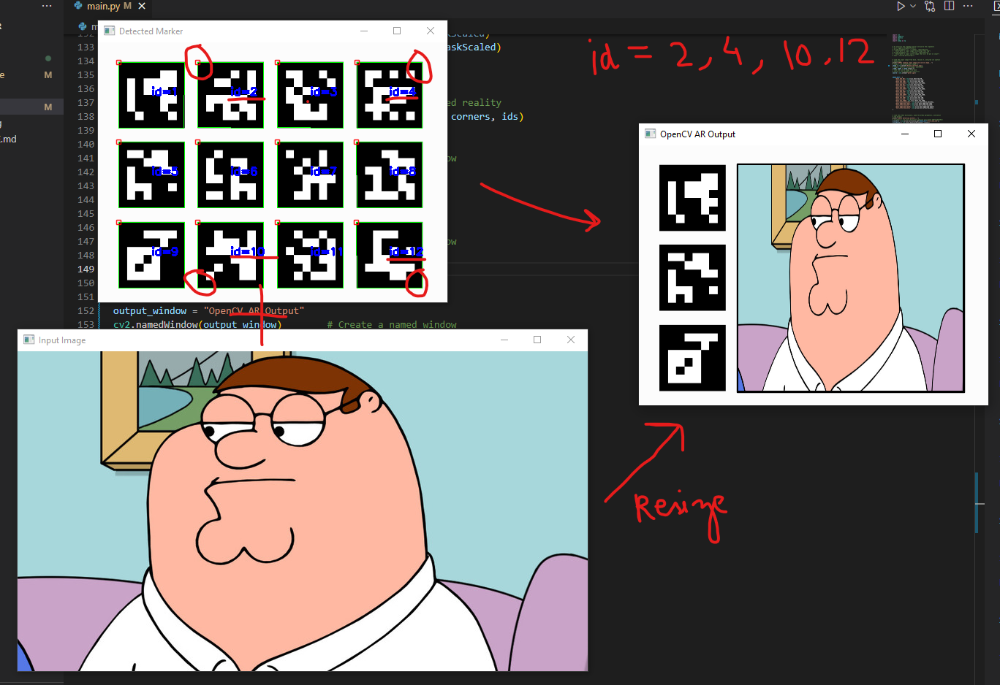

# Python-AR
Trying to build Augmented Reality experience using python OpenCV.

### Day 1 (3hrs) : 
> Setup OpenCV + ArUco(Markers) : Able to track the markers in a image and put augmented image. Basically image based marker system but for static image.  

### Day 2

https://user-images.githubusercontent.com/61538582/200516394-1c307c1d-94f5-475a-b8b2-35fc7872e198.mp4

